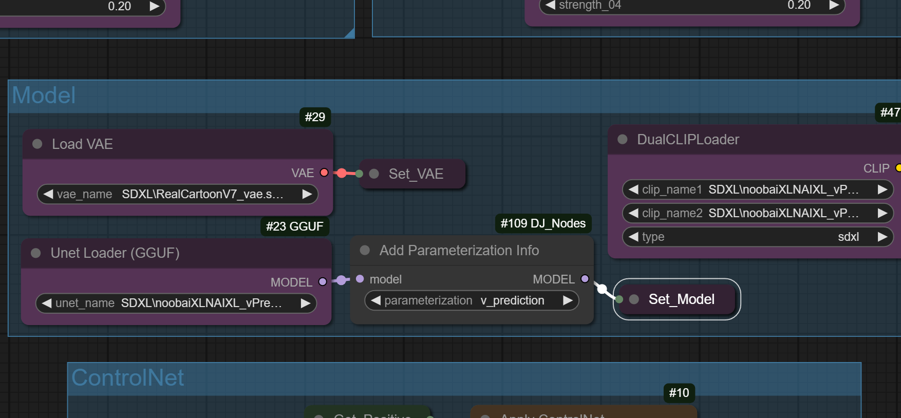

# ComfyUI-V-Prediction-Node
Node to set v-prediction sampling when using SDXL and other models that may not have the necessary metadata to identify it as a v-prediction model.
This node is useful for quantized models since they lack the necessary metadata.

### The basic workflow
The workflow is simple.

1. Add the "AddParam" node to your ComfyUI workflow.

2. Connect the "AddParam" node to the model loader node (e.g., the UNetLoader).
  
3. Select "epsilon" or "v_prediction" from the dropdown menu.

### Installation
Use GIT:

1. Navigate to the `custom_nodes` folder inside the ComfyUI directory.

cd ComfyUI/custom_nodes

2. Git-clone this repository

git clone https://github.com/magekinnarus/ComfyUI-V-Prediction-Node.git

3. Restart ComfyUI after installing, and the node will be available for you to use.

### Acknowledgement
ComfyUI: this node utilizes the modules in the ComfyUI codebase for its functions.
